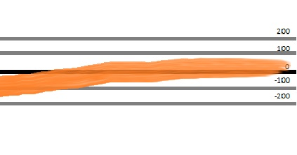
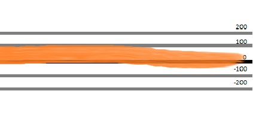
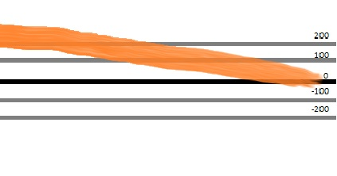
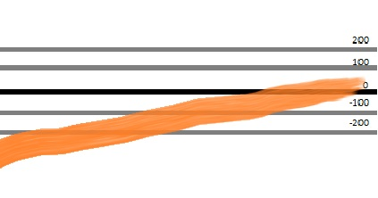

## jQuery Event Swipe

A simple jQuery event swipe library. When a swipe happens an event will be triggered.    

Install with `npm install swipe_event_jquery`  

I needed a simple method to figure out if a swipe had happened or not and none of the libraries currently available gave 
me a an easy to manage drop in method. So I made my own.

This library is focussed on pure node project integration that will be compiled with something into a single JS file that's served to the browser, 
and will not run as a stand alone, in a non node enviroment, unless you modify the source a bit.
The events will attach themselves to whichever jQuery instance is returned by `require('jquery');` 


Read the documentation and play with the demo on https://tschallacka.github.io/npm_jquery_event_swipe/

There are four events.

```javascript
$(element).on("swipe.up", (e) => {});
$(element).on("swipe.down", (e) => {});
$(element).on("swipe.left", (e) => {});
$(element).on("swipe.down", (e) => {});
$(element).on("swipe.all", (e) => {}); // Triggers on all swipe directions
```

# the event object

The event will be triggered on the element that was swiped. The directional event is triggered first, 
then the "all" event will run. preventDefault has no effect on these events.

The event object will have the following relevant properties:

**event.direction**  
Can be `"up"`, `"down"`, `"left"` and `"down"`

**event.distance**  
The distance covered in the recorded swipe in pixels. This is the distance along the measured axis, 
not accounting for extra distance traveled along the perpendicular axis.

**event.duration**  
How long it took for the swipe to complete.   
To calculate the speed you can divide `distance / duration`.

**event.deviation**
The deviation perpendicular to the swipe direction. Can be negative or positive.

# Gotcha

When looking for an up or down swipe, please note that that the document will continue to scroll/flinged to position.
There are several tricks you can apply, but they vary by use case.
One trick you might consider using is setting the overflow-y property on the document when the touchstart happens within a wrapping element

```javascript
let $swipefield = $('.swipefield');
    $body = $('body');
	
$swipefield.on('touchstart', (e) => {
	$body.css({
		'overflow-y': 'hidden'
	});
});
$swipefield.on('touchend', (e) => {
	$body.css({
		'overflow-y':''
	});
});
```

# Managing the settings.

There are three settings that can be managed for the swiper.

**threshold**   
How many pixels need to be travelled at a minimum to count as a swipe and not a tap.  
**default** `50`

**restraint**   
Maximum numbers of pixels that can be travelled at an a perpendicular direction that it can still be counted as a swipe and not a scroll.  
So if you are swiping left you allow the swipe this many pixels to deviate to the top and bottom.
**default**  `200`

For example, these are swipes with the orange path marking the movement of the swipe. The black line is the starting point
of the swipe, the gray lines showing how many pixels up and down it moves. The orange line shows the path of the swipe.

Valid swipes at restraint 200:  
   
    
    

Invalid swipes because they deviate too much:

   
    

**allowedTime**  
Maximum time in milliseconds for a swipe to complete. Otherwise it may be a slow scroll.  
**default**  `300`

You can set these settings by using the function returned by npm's require.

```javascript
let swipeSettingsManager = require('jquery_event_swipe');
swipeSettingsManager({
	threshold: 50,
	restraint: 200,
	allowedTime: 300
});
```

You don't need to set them all at once, only the ones you need changed. Do keep in mind that the changes are global.

```javascript
let swipeSettingsManager = require('jquery_event_swipe');
swipeSettingsManager({
	allowedTime: 100
});
```

